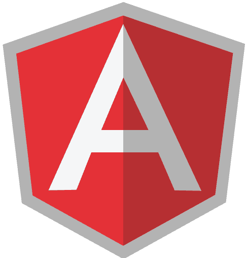

<p align="center">
    
</p>

Angular 8 New Features and changes
=====================
Welcome
---------------------
Hi All, I'm **`Dinanath Jayaswal, Senior UI/Web Developer and Adobe Certified Expert Professional`**, I wanna welcome you to `Angular7 step by step guide`. In this course/tutorial will go over, understand, learn and summarize some of the most important new features officially announced by the Angular Team.

Let’s go over what’s New features and Breaking changes introduced in Angular 8.  Will try to understand a bunch of workflow and performance improvements as well as how to go about upgrading our older Angular (Angular v7/6/5/4/2) apps over to Angular 8.

Who is this for? 
---------------------
This course/tutorial is for anyone and everyone, Almost everyone! Fresher/Newcomer as well as experienced UI/frontend/Web Developers who are interested in upgrading knowledge by understanding new cutting edge features, boost skills, and further career - by learning new latest dynamic JavaScript framework from Google to become a hi-tech developer.

Topics include
===================== 
1. [Angular8 Introduction](#01-angular8-introduction)
2. [Angular8 New features](#02-angular8-new-features)
    - 2.1. [Differential loading](#21-differential-loading)
    - 2.2. [Dynamic imports for lazy routes](#22-dynamic-imports-for-lazy-routes) 
    - 2.3. [Experimental support for Ivy](#23-experimental-support-for-ivy) 
    - 2.4. [Bazel](#24-Bazel) 
    - 2.5. [CLI API workflow improvements](#25-cli-api-workflow-improvements) 
    - 2.6. [Web Worker Support](#26-web-worker-support) 
3. [Angular8 Breaking changes](#03-angular8-breaking-changes) 
4. [Upgrading to Angular8](#04-upgrading-to-angular8)
5. [Upgrading Angular Material](#05-upgrading-angular-material)

01 Angular8 Introduction
=====================
- Angular is the most popular JavaScript (TypeScript based) open-source front-end web application framework from Google for developing client-side (front-end) mobile and desktop web apps or SPAs
- Angular 8 is finally released on `May 28 Tuesday, 2019`!
- With the 8.0.0 a major release of Angular we have a new set of powerful features that developers will appreciate which are added at many levels - complete platform; `the Angular core framework, Angular Material library and the Angular Command Line Interface or CLI` - all three are now v8

02 Angular8 New features
=====================
- As Google Angular Team announced and planned, `Major version upgrade twice a year` - Angular 8 was released in May 2019, **Angular 9 is in pipeline - can be released in October/November 2019**.  
- Angular 8 release improves:
    - application startup time on modern browsers, 
    - provides new APIs for tapping into the CLI, and 
    - aligns Angular to the ecosystem and more web standards 

Here are the new and most important features of Angular 8:

2.1. Differential loading
---------------------
- `Differential loading` is the technique/process which will `automagically make Angular app more performant (faster)`
- `Differential loading` is a process which automatically creates multiple production bundles for modern and legacy browsers
- When a developer will build an application for production - `two bundles are created`
    1. First bundle - For Modern browser that supports ES6+
    2. Second bundle - For an Older browser that supports only ES5
- As and when user will load application in the browser they will automatically get the correct bundle they need (thanks to ES6 modules in newer browsers)
- A great performance improvement With Angular 8 Differential loading feature `applications generally save 7–20% of their bundle size` depending on the number of modern JavaScript features they take advantage of (As for Modern browser that support ES6+ lesser code/polyfills to be loaded)
- We don’t have to do anything extra/special to get out of the box benefit of differential loading: just the ng build command with the --prod flag will take care of bundling everything:
```
ng build --prod
```
- Learn more about differential loading - [https://angular.io/guide/deployment#differential-loading](https://angular.io/guide/deployment#differential-loading)

2.2. Dynamic imports for lazy routes
---------------------
- Lazy routes refer to load the code for the routes/views only when the user navigates to those routes for the first time - it will improve the performance
- Angular 8 Lazy-loaded routes now migrating/using the `industry standard dynamic import syntax `supported well in modern editors instead of an old angular `custom string` (It simply means that TypeScript and linters will be better able to complain when modules are missing or misspelled)
- Here is the syntax difference:

So a lazy-loaded import that looked like this:
```ts
{ path: '/employee', loadChildren: './employee/employee.module#EmployeeModule' }
```

Will now changed and look like this:
```ts
{ path: `/employee`, loadChildren: () => import(`./employee/employee.module`).then(m => m.EmployeeModule) }
```

2.3. Experimental support for Ivy
---------------------
- `Ivy` is the new, latest and improved internal `rendering engine` from Angular team which drastically shrinks bundle sizes
- Ivy works on translating templates and components into regular HTML and JavaScript that the browser can easily understand
- In Angular 8 release - Ivy is `Not yet stable/ready for production`, it may be official/default rendering engine in Angular 9 
- A developer can enable `Ivy` in Angular application by using the command:
```
ng new angular8-demo --enable-ivy
```
- `Ivy` generates considerably smaller bundle chunks, make incremental compilation easier and also it will going to be the basis for future innovations and developments
- Look more about Ivy: [https://angular.io/guide/ivy](https://angular.io/guide/ivy)

2.4. Bazel
---------------------
- `Bazel` is the new `build system tool/process`, to be ready for official use with Angular to optimize overall build flow and speed (Webpack, TypeScript)
- In Angular 8 release - Bazel is `Not yet stable / its experimental`, it may be an official/default build system tool in Angular 9 
- To use Bazel in a new application, first install @angular/bazel globally:
```
npm install -g @angular/bazel
```
- then create the new application with the command:
```
ng new --collection=@angular/bazel
```
- To opt-in an existing application, run command:
```
ng add @angular/bazel
```
- Check more about Bazel: [https://github.com/angular/angular-bazel-example](https://github.com/angular/angular-bazel-example) and [https://angular.io/guide/bazel](https://angular.io/guide/bazel)

2.5. CLI API workflow improvements
---------------------
- The Angular CLI is improved a lot, now the `ng build`, `ng test` and `ng run` are extended to/by 3rd-party libraries and tool. Note: `AngularFire` already makes use of these new capabilities with a `deploy` command

2.6. Web Worker Support
---------------------
- Web workers are taken into consideration when building the production bundles which helps increase the performance
- Web workers are a great way to speed up your application of CPU-intensive processing, as Web workers allow you to offload `work to a background thread` (such as an image or video manipulation)
- Command to generate and add Web Worker
```
ng generate webWorker video-worker
```
- Read more on CLI Web Worker Support: [https://angular.io/guide/web-worker](https://angular.io/guide/web-worker)

**Summary:**

| Experimental support for Ivy | Experimental support for Bazel | Differential loading   | 
| -----------------------------|------------------|------------------|
| `Ivy` is the new internal `rendering engine` which should drastically shrink bundle sizes  | `Bazel` is the new `build system tool/process`, to be ready for official use with Angular to optimize overall build flow and speed (Webpack, TypeScript)| `Differential loading` is process which automatically creates multiple production bundles for modern and legacy browsers        |
| Not yet stable/ready for production          | Not fully finished/tested              | Decreases bundle size 7-20%           |
| Can be enabled to check/play around          | Can be enabled to check/play around    | Just use the command: `ng build --prod`    |

03 Angular8 Breaking changes
=====================
Here are some of the breaking changes one should check/verify and ensure while working with Angular 8:

3.1. Typescript version
---------------------
- To work with Angular 8 you must need and `use Typescript version 3.4 and above`

3.2. Node version
---------------------
- With Angular 8 you must need and `use Node version 12 or later`

3.3. HttpModule and Http service
---------------------
- With Angular 8 legacy `HttpModule` and `Http` service is deprecated
- Now we have to use `HttpClientModule` and the `HttpClient` service 

3.4. ViewChild ContentChild syntax
---------------------
- In Angular 8 ViewChild syntax changed:

old syntax:
```ts
@ViewChild('header') header: ElementRef;
```

new syntax:
```ts
@ViewChild('header', {static: false}) header:ElementRef;
```

04 Upgrading to Angular8
=====================
- Only one command to take care of update an existing app to Angular8:
```
ng update @angular/cli @angular/core
```
- Check more on update/upgrade to angular8: [https://update.angular.io/](https://update.angular.io/)


05 Upgrading Angular Material
=====================
- To update Angular Material use this command:
```
ng update @angular/material
```
